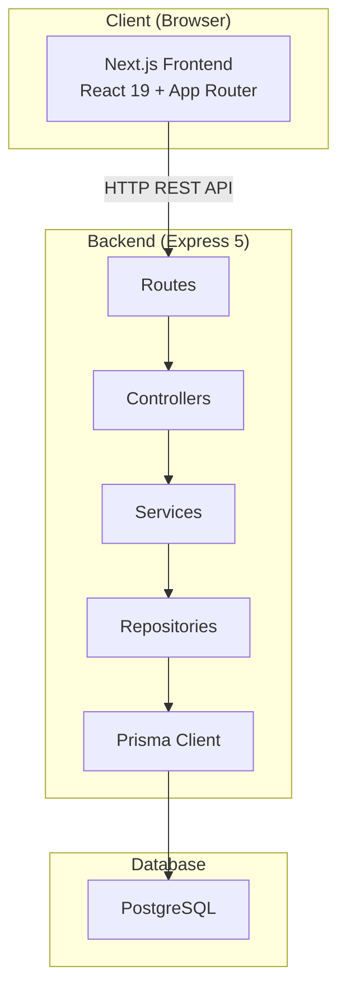
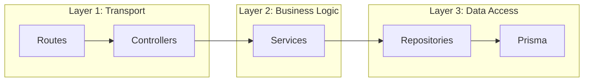
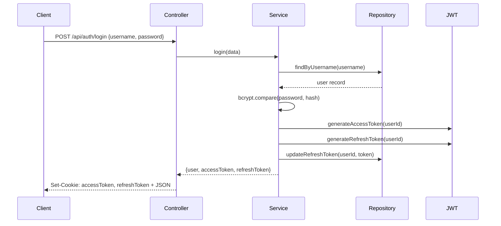
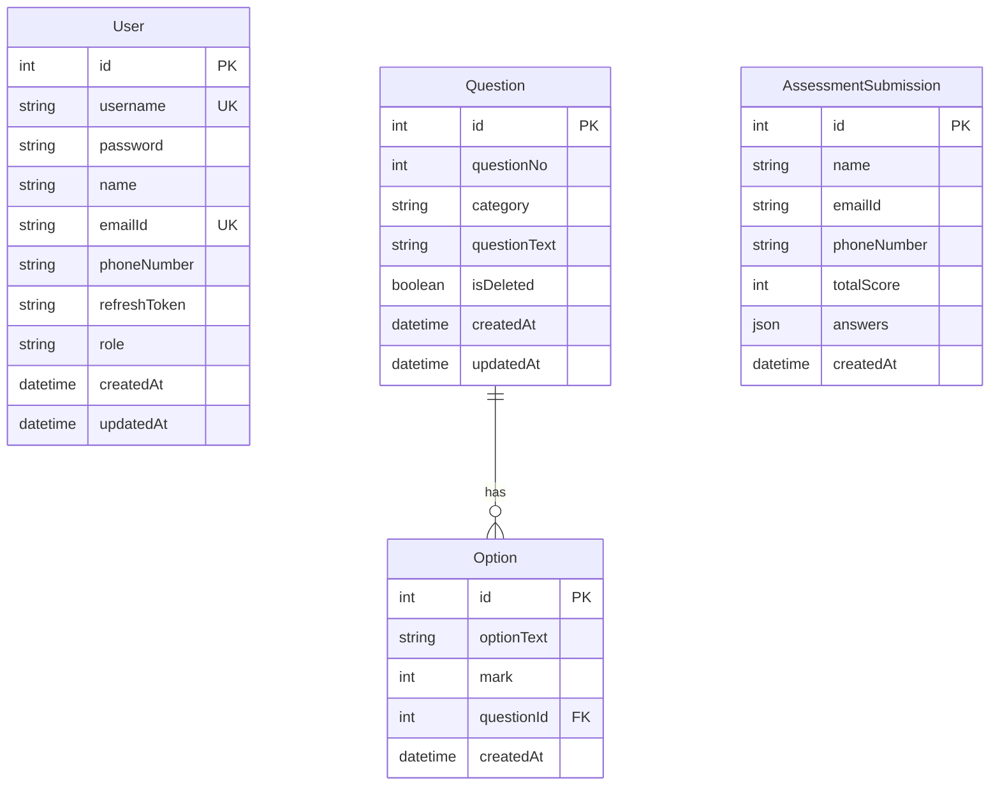
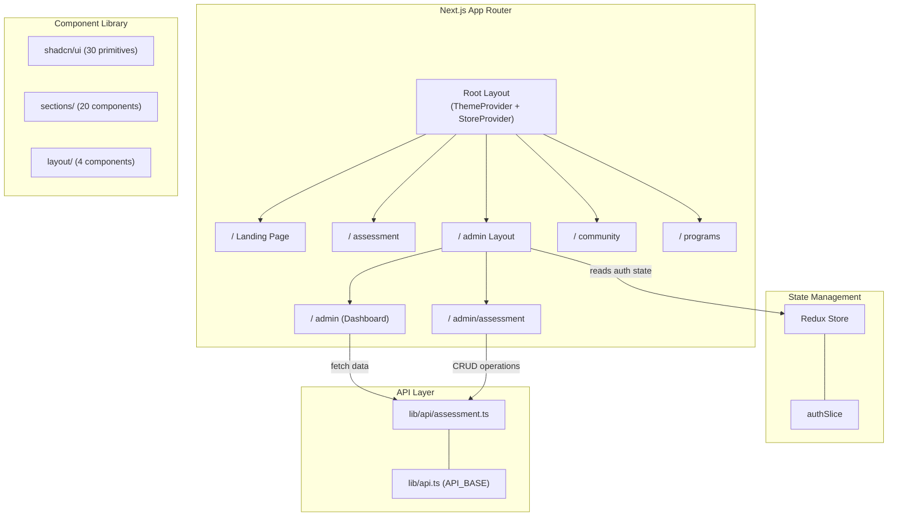

# 🎓 Teaching Mode: Full Architecture Analysis — Happy3 (Happiness Coaching Academy)

> This document is a **deep-dive educational analysis** of your project. Each section explains *what* the code does, *why* it's structured this way, *what's good*, *what's not*, and *how to make it industry-grade*.

---

## Table of Contents

1. [Project Overview](#1-project-overview)
2. [Backend Architecture Analysis](#2-backend-architecture-analysis)
3. [Frontend Architecture Analysis](#3-frontend-architecture-analysis)
4. [SOLID Principles Assessment](#4-solid-principles-assessment)
5. [What Architectural Patterns Does This Project Follow?](#5-what-architectural-patterns-does-this-project-follow)
6. [How to Improve: Backend](#6-how-to-improve-backend)
7. [How to Improve: Frontend](#7-how-to-improve-frontend)
8. [Summary Report Card](#8-summary-report-card)

---

## 1. Project Overview

**Happy3** is a full-stack web application for a **Happiness Coaching Academy** with:
- A **public-facing landing page** (marketing/branding)
- A **self-assessment quiz** for users
- An **admin dashboard** for managing questions, options, and viewing submissions

| Layer | Technology |
|---|---|
| **Backend** | Express 5 + TypeScript + Prisma ORM + PostgreSQL |
| **Frontend** | Next.js 16 (App Router) + React 19 + Redux Toolkit + TailwindCSS 4 + shadcn/ui |
| **Auth** | JWT (access + refresh tokens via HttpOnly cookies) |
| **Database** | PostgreSQL (via Prisma with `@prisma/adapter-pg`) |



---

## 2. Backend Architecture Analysis

### 2.1 Directory Structure

```
backend/src/
├── app.ts                 # Express app setup (CORS, middleware, routes)
├── server.ts              # Entry point (dotenv, DB connect, listen)
├── config/
│   └── db.config.ts       # Prisma + PG pool singleton
├── controller/
│   ├── auth.controller.ts
│   ├── question.controller.ts
│   ├── option.controller.ts
│   └── assessment.controller.ts
├── service/
│   ├── auth.service.ts
│   ├── question.service.ts
│   ├── option.service.ts
│   └── assessment.service.ts
├── repositories/
│   ├── auth.repository.ts
│   ├── question.repository.ts
│   ├── option.repository.ts
│   └── assessment.repository.ts
├── middlewares/
│   └── auth.middleware.ts
├── dtos/
│   ├── login.dto.ts
│   └── register.dto.ts
└── utils/
    └── jwt.ts
```

### 2.2 Layered Architecture — What Each Layer Does

Your backend follows a **3-Tier/Layered Architecture**. Let me teach you what each layer is responsible for:



#### 📘 Layer 1: Routes + Controllers (Transport Layer)

**Purpose**: Accept HTTP requests, extract parameters, call services, format HTTP responses.

**What your code does well:**
- Routes are cleanly separated per domain entity (`auth`, `question`, `option`, `assessment`)
- Controllers handle try/catch and return consistent `{ success, data/message }` JSON

**Example flow** — Creating a question:
```
POST /api/questions/createQuestion
  → question.route.ts (routes the request)
    → question.controller.ts#createQuestion (extracts req.body, calls service)
      → question.service.ts#createQuestionWithOptions (orchestrates logic)
        → question.repository.ts#createQuestion (Prisma DB call)
        → option.repository.ts#createManyOptions (Prisma DB call)
```

> [!NOTE]
> **Teaching Point**: Controllers should be *thin*. They should ONLY do: (1) parse input, (2) call service, (3) format output. Your controllers mostly follow this correctly — good job!

#### 📘 Layer 2: Services (Business Logic Layer)

**Purpose**: Contain all business rules. Services know *what* to do but not *how* to store data.

**Example** — [auth.service.ts](file:///d:/happy3/backend/src/service/auth.service.ts):
- Checks if username exists (business rule: uniqueness)
- Hashes password (security rule)
- Generates tokens (auth rule)
- Stores refresh token (session rule)

**Example** — [assessment.service.ts](file:///d:/happy3/backend/src/service/assessment.service.ts):
- Validates required fields (business validation)
- Calculates `totalScore` from answers (business logic)
- Delegates persistence to repository

#### 📘 Layer 3: Repositories (Data Access Layer)

**Purpose**: Encapsulate all database queries. The rest of the app never touches Prisma directly.

**Example** — [question.repository.ts](file:///d:/happy3/backend/src/repositories/question.repository.ts):
- `createQuestion()` — wraps `prisma.question.create()`
- `getAllQuestions()` — wraps `prisma.question.findMany()` with filters
- `deleteQuestion()` — soft-delete via `isDeleted: true`

> [!TIP]
> **Teaching Point**: The repository pattern is valuable because if you ever switch from Prisma to raw SQL, Drizzle, or TypeORM — you only change repository files. Services remain untouched.

### 2.3 Authentication Architecture



**What's good:**
- HttpOnly cookies (XSS protection)
- Separate access/refresh tokens with different expiry times
- Refresh token rotation (new token on each refresh)
- Refresh token stored in DB for invalidation

**What needs improvement:**
- `secure: false` is hardcoded (should be `process.env.NODE_ENV === 'production'`)
- No rate limiting on login/register endpoints
- Cookie config is duplicated 3 times across controller methods
- No password strength validation

### 2.4 Database Schema Analysis



> [!WARNING]
> **Schema Issues**:
> - `AssessmentSubmission.answers` is stored as raw JSON — no referential integrity, no ability to query individual answers efficiently
> - `User.role` is a plain `String` — should be an enum to prevent invalid values like `"admim"` (typo)
> - `AssessmentSubmission` has no relationship to `User` — you can't track who (if authenticated) submitted
> - `Question.questionNo` has no unique constraint — duplicates possible

---

## 3. Frontend Architecture Analysis

### 3.1 Directory Structure

```
frontend/src/
├── app/                         # Next.js App Router pages
│   ├── layout.tsx               # Root layout (fonts, providers, globals)
│   ├── page.tsx                 # Landing page (marketing)
│   ├── globals.css              # Global Tailwind + custom CSS
│   ├── admin/                   # Admin panel
│   │   ├── layout.tsx           # Admin scoped layout + theme
│   │   ├── page.tsx             # Admin dashboard
│   │   ├── admin-theme-manager.tsx
│   │   ├── data.json            # Static dashboard data
│   │   └── assessment/
│   │       └── page.tsx         # Admin assessment management (29KB!)
│   ├── assessment/
│   │   └── page.tsx             # Public assessment page
│   ├── community/
│   │   └── page.tsx
│   └── programs/
│       └── page.tsx
├── components/
│   ├── ui/                      # shadcn/ui primitives (30 files)
│   ├── sections/                # Landing page sections (20 files)
│   ├── layout/                  # Navbar, Footer, etc.
│   ├── admin/                   # Admin-specific components
│   ├── assessment/              # Assessment flow
│   ├── shared/                  # Shared reusable components
│   └── [dashboard components]   # Sidebar, charts, data-table
├── lib/
│   ├── api.ts                   # API base URL
│   ├── api/assessment.ts        # Assessment API functions
│   ├── store/
│   │   ├── store.ts             # Redux store config
│   │   ├── StoreProvider.tsx    # Provider + auth initializer
│   │   └── features/
│   │       └── authSlice.ts     # Auth state slice
│   └── utils.ts                 # cn() utility
├── hooks/
│   └── use-mobile.ts            # Responsive hook
├── styles/
│   ├── admin.css                # Admin-scoped CSS
│   ├── background.css           # Animated backgrounds
│   ├── animations.css
│   ├── gradients.css
│   └── shadows.css
├── types/
│   └── assessment.ts            # TypeScript interfaces
├── constants/                   # Empty
├── data/                        # Empty
└── proxy.ts                     # Next.js middleware (auth guard)
```

### 3.2 Architecture Diagram



### 3.3 State Management

**Redux Toolkit** is used but *only* for authentication state:

| State Key | Purpose |
|---|---|
| `auth.user` | Current logged-in user object |
| `auth.isAdmin` | Boolean admin flag |
| `auth.isInitialized` | Whether auth check is complete |

> [!IMPORTANT]
> **Teaching Point**: Redux is overkill for just auth state. React Context or a lightweight library like Zustand would be simpler. Redux shines when you have complex, interconnected state across many features. Right now you have exactly **1 slice**.

### 3.4 API Communication Pattern

The frontend communicates with the backend using **raw `fetch()`** calls:

```typescript
// lib/api/assessment.ts — the API layer
export async function fetchQuestions(): Promise<Question[]> {
  const res = await fetch(`${API_BASE}/api/questions/getAllQuestions`);
  const json = await res.json();
  if (!json.success) throw new Error("Failed to fetch questions");
  return json.data;
}
```

**What's good:**
- Centralized API functions in `lib/api/`
- Typed return values with TypeScript interfaces
- Error handling with thrown errors

**What's missing:**
- No request/response interceptors (for auto-attaching auth tokens, auto-refreshing expired tokens)
- No loading/error states managed centrally
- No caching, deduplication, or revalidation (SWR/React Query patterns)
- Hardcoded `http://localhost:5000` in [StoreProvider.tsx](file:///d:/happy3/frontend/src/lib/store/StoreProvider.tsx#L20) — bypasses `API_BASE`

### 3.5 Component Architecture

| Category | Count | Examples |
|---|---|---|
| **UI Primitives** (shadcn/ui) | 30 | Button, Card, Dialog, Table, Sidebar |
| **Landing Sections** | 20 | Hero, ChallengeSection, PillarsSection |
| **Layout** | 4 | Navbar, Footer, ScrollProgress |
| **Admin** | 1 | ThemeToggle |
| **Assessment** | 1 | AssessmentFlow |
| **Shared** | 4 | SectionTitle, SocialIcons, FloatingBadge |

> [!WARNING]
> **Red Flag**: The file [admin/assessment/page.tsx](file:///d:/happy3/frontend/src/app/admin/assessment/page.tsx) is **29KB / ~800+ lines** — a single file. This is a "God Component" anti-pattern. It likely contains form logic, table rendering, API calls, state management, and UI all mixed together.

---

## 4. SOLID Principles Assessment

### Does this project follow SOLID? Let's check each principle:

### 📕 S — Single Responsibility Principle (SRP)

> *"A class/module should have one, and only one, reason to change."*

| Verdict | **PARTIALLY FOLLOWED** |
|---|---|

**✅ Where SRP is followed:**
- Repository classes have one job: database queries
- DTOs define data shapes only
- JWT utils handle only token operations
- Routes only define URL-to-handler mapping

**❌ Where SRP is violated:**

1. **[auth.controller.ts](file:///d:/happy3/backend/src/controller/auth.controller.ts)** — The controller handles **both** HTTP response formatting **and** cookie configuration. Cookie settings (httpOnly, maxAge, sameSite, secure) are duplicated 3 times:

```typescript
// This cookie config block is copy-pasted in register(), login(), and refresh()
.cookie("accessToken", result.accessToken, {
  httpOnly: true,
  secure: false,
  maxAge: 15 * 60 * 1000,
  sameSite: "lax"
})
```

2. **[StoreProvider.tsx](file:///d:/happy3/frontend/src/lib/store/StoreProvider.tsx)** — This file is responsible for: (a) wrapping the Redux Provider, (b) silently refreshing auth on mount, (c) reading/writing localStorage, (d) handling offline demo mode. That's **4 responsibilities**.

3. **[admin/assessment/page.tsx](file:///d:/happy3/frontend/src/app/admin/assessment/page.tsx)** — At 29KB, this is almost certainly doing: UI layout, form handling, API calls, state management, and validation in one file.

---

### 📗 O — Open/Closed Principle (OCP)

> *"Software entities should be open for extension, but closed for modification."*

| Verdict | **NOT FOLLOWED** |
|---|---|

**❌ Violations:**

1. **Adding a new entity requires modifying [app.ts](file:///d:/happy3/backend/src/app.ts)**:
```typescript
// You must edit this file every time you add a new route
app.use("/api/auth", authRouter)
app.use("/api/questions", questionRouter)
app.use("/api/options", optionRouter)
app.use("/api/assessment", assessmentRouter)
// Adding /api/users? → Must modify this file
```

2. **Error handling is not extensible** — Each controller has its own try/catch with hardcoded status codes. There's no global error handler or error class hierarchy.

3. **Cookie configuration is hardcoded** — To change cookie settings, you must edit the controller directly rather than using a configurable strategy.

---

### 📘 L — Liskov Substitution Principle (LSP)

> *"Subtypes should be substitutable for their base types."*

| Verdict | **NOT APPLICABLE (mostly)** |
|---|---|

Your project doesn't use inheritance or polymorphism significantly. There are no abstract base classes or interfaces that different implementations could substitute. This principle becomes relevant when you have, for example:
- `IUserRepository` interface with `PrismaUserRepository` and `MongoUserRepository` implementations
- Base `Controller` class that subclasses extend

**Currently**: All classes are concrete, standalone implementations with no substitution points.

---

### 📙 I — Interface Segregation Principle (ISP)

> *"Clients should not be forced to depend on interfaces they don't use."*

| Verdict | **NOT FOLLOWED (no interfaces exist)** |
|---|---|

**❌ The project has zero interfaces for its service/repository layers.**

- Repositories are concrete classes, not interface implementations
- Services directly instantiate concrete repository classes
- There are DTOs (`LoginDTO`, `RegisterDTO`), but only for auth — no DTOs for Question, Option, or Assessment operations

```typescript
// question.service.ts — directly creates concrete instances
const questionRepository = new QuestionRepository();  // No interface
const optionRepository = new OptionRepository();       // No interface
```

---

### 📒 D — Dependency Inversion Principle (DIP)

> *"High-level modules should not depend on low-level modules. Both should depend on abstractions."*

| Verdict | **NOT FOLLOWED** |
|---|---|

**❌ This is the most significant violation in the project.**

Every service directly imports and instantiates its own dependencies:

```typescript
// question.service.ts
import { QuestionRepository } from "../repositories/question.repository";
const questionRepository = new QuestionRepository();  // Tight coupling!
```

**Why this is bad (teaching moment):**
- You can't swap `QuestionRepository` for a mock in tests
- You can't run `QuestionService` with an in-memory database
- The service *creates* its own dependency instead of *receiving* it

**What it should look like:**
```typescript
// With DIP (Dependency Injection)
export class QuestionService {
  constructor(
    private questionRepo: IQuestionRepository,
    private optionRepo: IOptionRepository
  ) {}
  
  // Now you can inject mocks for testing!
}
```

---

### 📊 SOLID Summary Scorecard

| Principle | Status | Score |
|---|---|---|
| **S** — Single Responsibility | Partially followed | 🟡 6/10 |
| **O** — Open/Closed | Not followed | 🔴 3/10 |
| **L** — Liskov Substitution | Not applicable | ⚪ N/A |
| **I** — Interface Segregation | Not followed | 🔴 2/10 |
| **D** — Dependency Inversion | Not followed | 🔴 2/10 |

---

## 5. What Architectural Patterns Does This Project Follow?

While the project doesn't follow SOLID, it **does** follow several recognized patterns:

### ✅ Patterns the Project Follows

| Pattern | Where | Quality |
|---|---|---|
| **Layered Architecture** | Controller → Service → Repository | 🟢 Well done |
| **Repository Pattern** | `repositories/` directory abstracts Prisma | 🟢 Well done |
| **DTO Pattern** | `dtos/` for auth data shapes | 🟡 Incomplete |
| **Soft Delete** | `isDeleted` flag on Questions | 🟢 Good practice |
| **Token Rotation** | New refresh token on each refresh | 🟢 Security best practice |
| **MVC-ish** (without Views) | Routes → Controllers → Services | 🟢 Clean separation |
| **Component-Based Architecture** | React component tree | 🟢 Standard React |
| **Feature-Based Organization** | Frontend components grouped by feature | 🟡 Partially |
| **Flux/Redux Pattern** | Unidirectional data flow with Redux | 🟡 Underutilized |

### ❌ Patterns That Are Missing

| Pattern | Why It Matters |
|---|---|
| **Dependency Injection** | Enables testability, loose coupling |
| **Global Error Handling** | Centralized error formatting, logging |
| **Request Validation** | Validates input before it reaches services |
| **API Versioning** | `/api/v1/...` for future backward compatibility |
| **Rate Limiting** | Prevents brute-force attacks |
| **Logging Strategy** | No structured logging (only `console.log/error`) |
| **Testing** | Zero test files exist |

---

## 6. How to Improve: Backend

### 🔧 Improvement 1: Dependency Injection

**Current Problem**: Services create their own dependencies (tight coupling).

**Solution**: Use constructor injection.

```diff
- // ❌ Current — tight coupling
- const questionRepository = new QuestionRepository();
- export class QuestionService {
-   async getQuestions() {
-     return await questionRepository.getAllQuestions();
-   }
- }

+ // ✅ Improved — dependency injection
+ interface IQuestionRepository {
+   getAllQuestions(): Promise<Question[]>;
+   createQuestion(data: CreateQuestionDTO): Promise<Question>;
+   getQuestionById(id: number): Promise<Question | null>;
+   updateQuestion(id: number, data: UpdateQuestionDTO): Promise<Question>;
+   deleteQuestion(id: number): Promise<Question>;
+ }
+ 
+ export class QuestionService {
+   constructor(
+     private readonly questionRepo: IQuestionRepository,
+     private readonly optionRepo: IOptionRepository
+   ) {}
+ 
+   async getQuestions() {
+     return await this.questionRepo.getAllQuestions();
+   }
+ }
```

### 🔧 Improvement 2: Global Error Handler Middleware

**Current Problem**: Every controller has its own try/catch with inconsistent error handling.

**Solution**: Create custom error classes and a global error handler.

```typescript
// utils/errors.ts — Custom error hierarchy
export class AppError extends Error {
  constructor(
    public statusCode: number,
    message: string,
    public isOperational = true
  ) {
    super(message);
  }
}

export class NotFoundError extends AppError {
  constructor(resource: string) {
    super(404, `${resource} not found`);
  }
}

export class ValidationError extends AppError {
  constructor(message: string) {
    super(400, message);
  }
}

export class UnauthorizedError extends AppError {
  constructor(message = "Unauthorized") {
    super(401, message);
  }
}
```

```typescript
// middlewares/error.middleware.ts
import { Request, Response, NextFunction } from "express";
import { AppError } from "../utils/errors";

export const errorHandler = (
  err: Error,
  req: Request,
  res: Response,
  next: NextFunction
) => {
  if (err instanceof AppError) {
    return res.status(err.statusCode).json({
      success: false,
      message: err.message,
    });
  }

  // Unexpected error — log it, return generic message
  console.error("Unhandled error:", err);
  res.status(500).json({
    success: false,
    message: "Internal server error",
  });
};
```

Then controllers become much cleaner:
```typescript
// ❌ Before
async deleteQuestion(req: Request, res: Response) {
  try {
    const id = parseInt(String(req.params.id), 10);
    const result = await questionService.deleteQuestion(id);
    res.status(200).json({ success: true, data: result });
  } catch (error) {
    console.error("Error in deleteQuestion:", error);
    res.status(500).json({ success: false, message: "Question deletion failed" });
  }
}

// ✅ After (with asyncHandler wrapper + global error handler)
async deleteQuestion(req: Request, res: Response) {
  const id = parseInt(String(req.params.id), 10);
  const result = await questionService.deleteQuestion(id);
  res.status(200).json({ success: true, data: result });
  // Errors automatically caught by asyncHandler → errorHandler
}
```

### 🔧 Improvement 3: Input Validation with Zod

**Current Problem**: `req.body` is typed as `any` and passed directly to services without validation.

```typescript
// ❌ Current — no validation, req.body is 'any'
async createQuestionWithOptions(body: any) {
  const { questionNo, category, questionText, options } = body;
```

**Solution**: Use Zod schemas for runtime validation.

```typescript
// dtos/question.dto.ts
import { z } from "zod";

export const CreateQuestionSchema = z.object({
  questionNo: z.number().int().positive(),
  category: z.string().min(1).max(100),
  questionText: z.string().min(1).max(2000),
  options: z.array(z.object({
    optionText: z.string().min(1),
    mark: z.number().int().min(0).max(10),
  })).min(2, "At least 2 options required"),
});

export type CreateQuestionDTO = z.infer<typeof CreateQuestionSchema>;
```

```typescript
// middlewares/validate.middleware.ts
import { z } from "zod";
import { Request, Response, NextFunction } from "express";

export const validate = (schema: z.ZodSchema) =>
  (req: Request, res: Response, next: NextFunction) => {
    const result = schema.safeParse(req.body);
    if (!result.success) {
      return res.status(400).json({
        success: false,
        errors: result.error.flatten().fieldErrors,
      });
    }
    req.body = result.data; // Typed and sanitized!
    next();
  };
```

### 🔧 Improvement 4: Environment Configuration

**Current Problem**: Port hardcoded, `secure: false` hardcoded, API URL hardcoded.

```typescript
// ❌ Current
app.listen(5000, () => { ... })

// auth.controller.ts
secure: false, // Set to true in production  ← comment, not code
```

**Solution**: Centralized configuration.

```typescript
// config/env.config.ts
import { z } from "zod";

const envSchema = z.object({
  NODE_ENV: z.enum(["development", "production", "test"]).default("development"),
  PORT: z.coerce.number().default(5000),
  DATABASE_URL: z.string().url(),
  JWT_ACCESS_SECRET: z.string().min(32),
  JWT_REFRESH_SECRET: z.string().min(32),
  CORS_ORIGINS: z.string(),
  COOKIE_SECURE: z.coerce.boolean().default(false),
});

export const env = envSchema.parse(process.env);
```

### 🔧 Improvement 5: Proper REST API Design

**Current Problem**: URLs contain verbs, which violates REST conventions.

```
❌ POST   /api/questions/createQuestion
❌ GET    /api/questions/getAllQuestions
❌ PUT    /api/questions/updateQuestion/:id
❌ DELETE /api/questions/deleteQuestion/:id
```

**Solution**: Resource-based URLs where the HTTP verb defines the action.

```
✅ POST   /api/v1/questions          → Create
✅ GET    /api/v1/questions          → List all
✅ GET    /api/v1/questions/:id      → Get one
✅ PUT    /api/v1/questions/:id      → Update
✅ DELETE /api/v1/questions/:id      → Delete
```

> [!TIP]
> **Teaching Point**: In REST, the URL is a *noun* (the resource). The HTTP method is the *verb* (the action). You never need both.

### 🔧 Improvement 6: Add Structured Logging

**Current Problem**: Using `console.log` and `console.error` throughout.

**Solution**: Use a logging library like `pino` or `winston`.

```typescript
// utils/logger.ts
import pino from "pino";

export const logger = pino({
  level: process.env.LOG_LEVEL || "info",
  transport: process.env.NODE_ENV === "development" 
    ? { target: "pino-pretty" } 
    : undefined,
});
```

### 🔧 Improvement 7: Add Tests

**Current Problem**: Zero test files. No test script configured.

**Minimum viable testing strategy:**
- **Unit tests** for services (mock repositories)
- **Integration tests** for API endpoints (supertest)
- **Schema validation tests** for DTOs

---

## 7. How to Improve: Frontend

### 🎨 Improvement 1: Break Up God Components

**Current Problem**: [admin/assessment/page.tsx](file:///d:/happy3/frontend/src/app/admin/assessment/page.tsx) is 29KB.

**Solution**: Split into focused components:

```
admin/assessment/
├── page.tsx                    # Page shell (< 50 lines)
├── components/
│   ├── QuestionList.tsx        # Renders the table of questions
│   ├── QuestionForm.tsx        # Create/Edit form
│   ├── QuestionRow.tsx         # Single row component
│   ├── OptionEditor.tsx        # Options management
│   └── SubmissionViewer.tsx    # View submissions
└── hooks/
    ├── useQuestions.ts         # Fetching + CRUD logic
    └── useAssessmentForm.ts   # Form state management
```

### 🎨 Improvement 2: Use React Query / SWR Instead of Raw Fetch

**Current Problem**: API calls use raw `fetch()` with no caching, loading states, error states, or revalidation.

**Solution**: Use TanStack React Query.

```typescript
// ❌ Current — manual fetch in component
const [questions, setQuestions] = useState([]);
const [loading, setLoading] = useState(true);
useEffect(() => {
  fetchQuestions().then(setQuestions).finally(() => setLoading(false));
}, []);

// ✅ With React Query — automatic caching, loading, error, refetch
import { useQuery, useMutation, useQueryClient } from "@tanstack/react-query";

function useQuestions() {
  return useQuery({
    queryKey: ["questions"],
    queryFn: fetchQuestions,
    staleTime: 30_000, // Cache for 30 seconds
  });
}

function useCreateQuestion() {
  const queryClient = useQueryClient();
  return useMutation({
    mutationFn: createQuestion,
    onSuccess: () => {
      queryClient.invalidateQueries({ queryKey: ["questions"] });
    },
  });
}
```

### 🎨 Improvement 3: Replace Redux with a Lighter Solution

**Current Problem**: Redux Toolkit is set up with only 1 slice (auth). This is like using a semi-truck to deliver a letter.

**Option A**: Use React Context for auth state
```typescript
// contexts/AuthContext.tsx
const AuthContext = createContext<AuthState | null>(null);

export function AuthProvider({ children }: { children: ReactNode }) {
  const [user, setUser] = useState<User | null>(null);
  // ... auth logic
  return <AuthContext.Provider value={{ user, login, logout }}>{children}</AuthContext.Provider>;
}
```

**Option B**: Use Zustand (minimal API, no boilerplate)
```typescript
// store/auth.ts
import { create } from "zustand";

interface AuthStore {
  user: User | null;
  isAdmin: boolean;
  setCredentials: (user: User, isAdmin: boolean) => void;
  clearCredentials: () => void;
}

export const useAuthStore = create<AuthStore>((set) => ({
  user: null,
  isAdmin: false,
  setCredentials: (user, isAdmin) => set({ user, isAdmin }),
  clearCredentials: () => set({ user: null, isAdmin: false }),
}));
```

### 🎨 Improvement 4: Create an API Client with Interceptors

**Current Problem**: Auth token refresh and error handling are scattered.

**Solution**: Create a centralized fetch wrapper.

```typescript
// lib/api/client.ts
class ApiClient {
  private baseUrl: string;

  constructor(baseUrl: string) {
    this.baseUrl = baseUrl;
  }

  async request<T>(endpoint: string, options: RequestInit = {}): Promise<T> {
    const res = await fetch(`${this.baseUrl}${endpoint}`, {
      ...options,
      credentials: "include",
      headers: {
        "Content-Type": "application/json",
        ...options.headers,
      },
    });

    // Auto-refresh on 401
    if (res.status === 401) {
      const refreshed = await this.refreshToken();
      if (refreshed) {
        return this.request(endpoint, options); // Retry
      }
      throw new AuthError("Session expired");
    }

    const json = await res.json();
    if (!json.success) throw new ApiError(json.message, res.status);
    return json.data;
  }

  private async refreshToken(): Promise<boolean> {
    const res = await fetch(`${this.baseUrl}/api/auth/refresh`, {
      method: "POST",
      credentials: "include",
    });
    return res.ok;
  }
}

export const api = new ApiClient(API_BASE);
```

### 🎨 Improvement 5: Fix the Middleware File

**Current Problem**: [proxy.ts](file:///d:/happy3/frontend/src/proxy.ts) is named `proxy.ts` but it's actually Next.js middleware. It's also not in the correct location for Next.js middleware (should be `middleware.ts` at root or `src/middleware.ts`).

**Solution**: Rename and restructure.

```
src/middleware.ts   ← Correct name and location for Next.js
```

### 🎨 Improvement 6: Eliminate Hardcoded URLs

**Current Problem** in [StoreProvider.tsx](file:///d:/happy3/frontend/src/lib/store/StoreProvider.tsx#L20):
```typescript
// ❌ Hardcoded URL — ignores the API_BASE constant
const response = await fetch("http://localhost:5000/api/auth/refresh", {
```

**Solution**: Use the existing `API_BASE` constant everywhere.

### 🎨 Improvement 7: Add Error Boundaries

**Current Problem**: No error boundaries. A runtime error in any component crashes the entire page.

**Solution**:
```typescript
// components/ErrorBoundary.tsx
"use client";
import { Component, ReactNode } from "react";

class ErrorBoundary extends Component<
  { children: ReactNode; fallback?: ReactNode },
  { hasError: boolean }
> {
  state = { hasError: false };

  static getDerivedStateFromError() {
    return { hasError: true };
  }

  render() {
    if (this.state.hasError) {
      return this.props.fallback ?? <div>Something went wrong.</div>;
    }
    return this.props.children;
  }
}
```

---

## 8. Summary Report Card

### Overall Architecture Grade: **C+** (Decent foundation, significant gaps)

| Category | Grade | Summary |
|---|---|---|
| **Layered Architecture** | **A-** | Clean Controller → Service → Repository separation |
| **Code Organization** | **B** | Good folder structure, but some god components |
| **Type Safety** | **C+** | TypeScript used but `any` appears in critical paths |
| **Security** | **C** | Good token strategy, but hardcoded `secure: false`, no rate limiting, no input validation |
| **Testability** | **F** | Zero tests, tight coupling prevents easy testing |
| **SOLID Compliance** | **D** | Only SRP partially followed |
| **REST API Design** | **D+** | Verb-in-URL anti-pattern, no versioning |
| **Error Handling** | **D+** | Per-method try/catch, no error hierarchy |
| **Frontend State** | **C** | Redux works but is overengineered for current needs |
| **API Communication** | **C-** | Raw fetch, no interceptors, hardcoded URLs |
| **DX (Developer Experience)** | **C** | No linting rules enforced, no testing, no CI/CD |

### Priority Improvement Roadmap

| Priority | Task | Impact |
|---|---|---|
| 🔴 **P0** | Add input validation (Zod) | Security + Data integrity |
| 🔴 **P0** | Fix hardcoded `secure: false` and localhost URLs | Security |
| 🟠 **P1** | Add global error handling middleware | Code quality + Consistency |
| 🟠 **P1** | Break up 29KB assessment page component | Maintainability |
| 🟡 **P2** | Add dependency injection | Testability |
| 🟡 **P2** | RESTful URL refactoring | API standards |
| 🟢 **P3** | Add React Query for data fetching | Performance + UX |
| 🟢 **P3** | Replace Redux with Zustand/Context | Simplicity |
| 🟢 **P3** | Add unit and integration tests | Reliability |
| 🔵 **P4** | API versioning (`/api/v1/`) | Future-proofing |
| 🔵 **P4** | Structured logging (pino/winston) | Observability |

---

> [!TIP]
> **Final Teaching Note**: Your project has a **very good foundation**. The layered architecture (Controller → Service → Repository) is the correct pattern used by professional teams. The gaps are in **discipline** (validation, error handling, testing) and **decoupling** (dependency injection, interfaces). Fixing these doesn't require rewriting — it requires *refining* what you already have.
